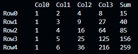

# Row Summation Table (C)

Calculates the per-row sum of a 2D integer array and prints a neatly aligned table with column headers and a final **Sum** column. Focuses on array traversal, accumulation, and formatted console output in C.

## Example Output

## Features
- 5×5 table with last column computed as the row sum
- Clean, aligned headers (`Col0…Col3`, `Sum`) and rows (`Row0…Row4`)
- Simple width management to keep columns readable as values grow

